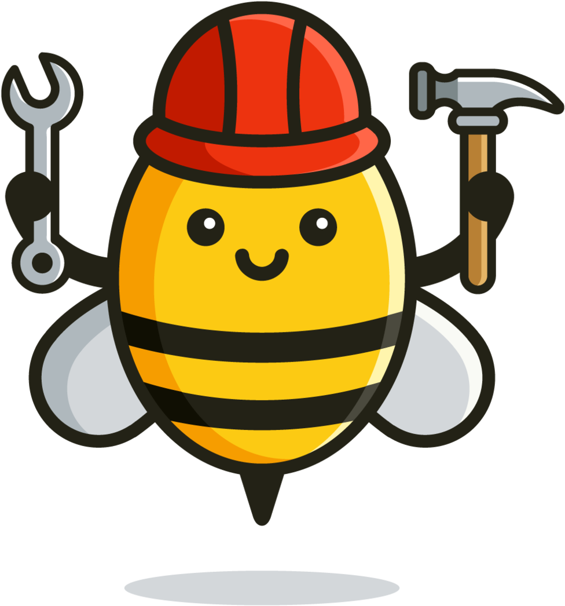

# Worker Bees
This Webpage was built as a class project for Web Programming in Q4/2020 at DHBW Ravensburg.

## Idea
Our goal was to create a platform with the ability to create offers and bookings in three different categories:
- Tools
- Workshops
- Services
<a/>
This way, people can live out their hobbies more easily, while being able to share and recieve valable know-how. The website was created under the premise of increasing sustainability, providing flexibility, and creating a community of craftsmen and craftwomen of any kind and level of experience. The amount of learning we experienced on the way was only a side-effect to a passionate idea unfolding in front of our eyes.

## Code & Infrastructure
All code was written in html, css, and php using visual studio code.\
The files are stored in a webspace provided by bplaced, which also includes the database for the website.

## Use
The website is written to be used in all traditional browsers on a PC.\
It can be accessed at [Worker Bees](http://workerbees.bplaced.net/).

## Features
The main features of the website have been implemented in Version 1.0
- [x] Login/Logout
- [x] Profile
- [x] Create Offers
- [x] View and Book Offers
- [ ] Booking Confirmation
- [ ] Map / Location of Offers
- [ ] Blog Page
- [ ] Chat

## Authors
- [Sarah](https://github.com/Arfarin)
- [Daniel](https://github.com/DanielBirk98)
- [Katerina](https://github.com/kmatysova2)
<a/>

##### We hope you have fun with our website. Let us know about questions and feedback!

Copyright © 2020, Worker Bees Team.
